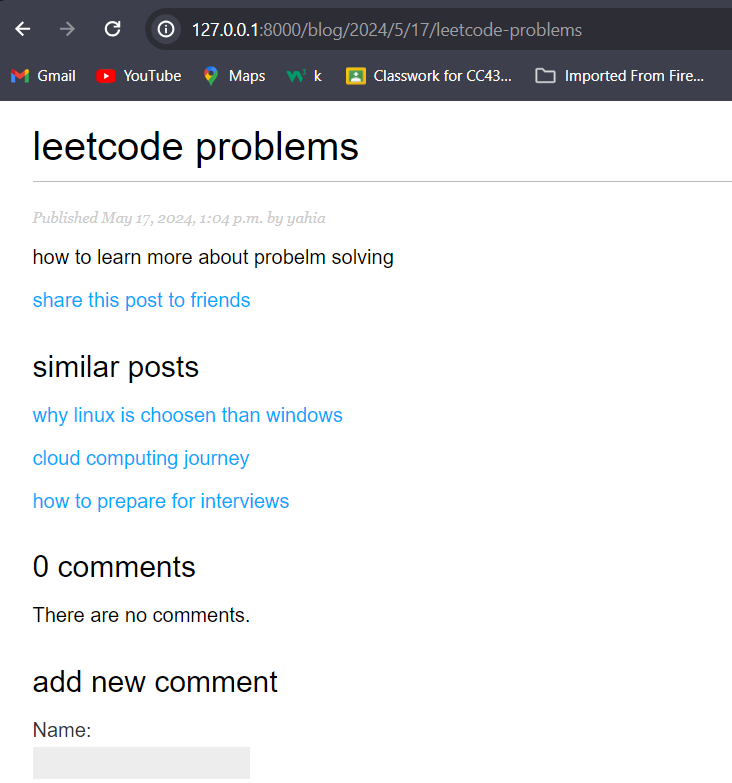

# Blog recommendation system :high_brightness:

:man_technologist:  Blog recommendation system allow users to share posts to friends via email and get recommendation to other posts via tags 
## Table of Contents
- [Features](#features)
- [Installation](#installation)
- [Images](#images)
- [Future Plans](#future-plans)

## Features  :muscle:
- *send emails* 
- *integerate third library toggit to provide recommendation to other posts*
- *view blogs by its specific tag*  
- *pagination and seo* 
- *sitemap*  
- *postgres (search engine) to search by title-body*  
- *getting most viewed posts* 
- *getting most commented post*  

## Installation
Before you begin the installation, ensure that you have the latest versions of **Python** and **PostgreSQL** installed on your system.

:warning: **Prerequisite Check**:
- **Python** (3.8 or later recommended): Check your version by running `python --version` in your command line.
- **PostgreSQL** (12.0 or later recommended): Check your version by running `psql --version` in your command line.

If you do not have these installed, please visit:
- [Python Downloads](https://www.python.org/downloads/)
- [PostgreSQL Downloads](https://www.postgresql.org/download/)

Once you have verified the installation of Python and PostgreSQL, proceed with the steps below:

1. Clone the repository 
```bash
git clone  https://github.com/yahiahamdan/BlogApplication.git
```
2. navigate to the project directory 
```bash
cd mysite
```
3. install dependencies 
```python
pip install -r requirments.txt
```
## Images 
###  /blog?page=2 
 containing all blogs in page2 and pagination limit 2  
 <p allign="center">
 
 </p>
 

###  /blog/2024/5/17/leetcode-problems
 blog can do comments and see similarPosts
  <p allign="center">
 
 </p>

 ### /blog/4/share
 sending blogs via email by writing my email and recipent email
  <p allign="center">
 
 </p>
 
 ### email recived
<p allign="center">
 
 </p>

### lastest post and comments 
<p allign="center">
 
 </p>

### search by title name or body 
<p allign="center">
 
 </p>

## Future Plans 
- **add amazon ses instead of mail service**
- **deploy the project using aws Elastic beanstalk**
- **adding django authentication for comments**


